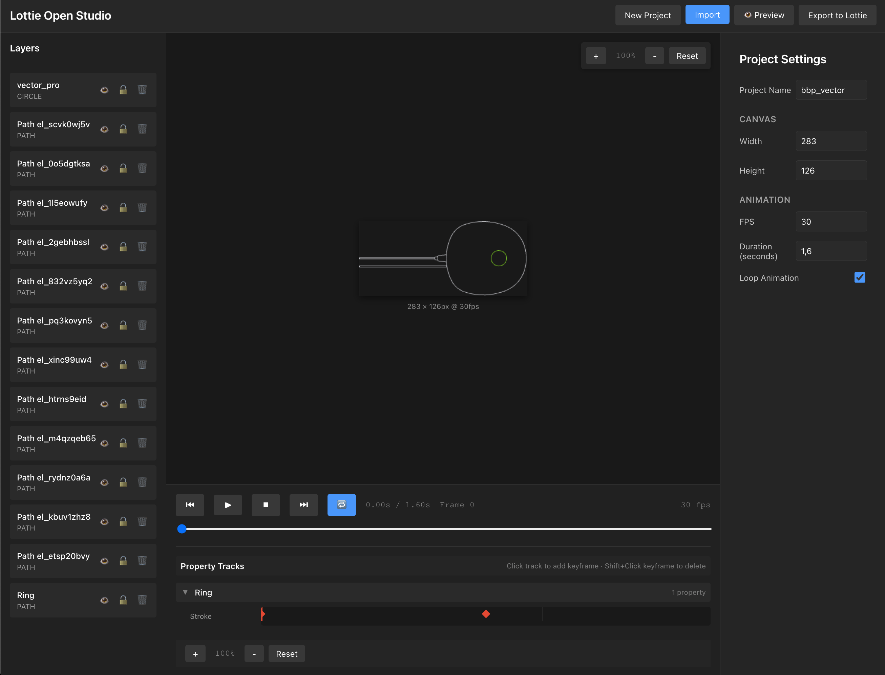

# Lottie Open Studio

An open-source web-based animation editor for creating and editing Lottie animations. Import SVGs, create keyframe animations, edit existing Lottie files, and export to JSON format.

## 🌐 Try it Online

**[Launch Lottie Open Studio](https://marciogranzotto.github.io/lottie-tools/)** - Try the live version directly in your browser!

[](LICENSE)
[](https://nodejs.org)



## 🎨 Features

### Current Status: 🚧 In Development (Milestone 8 Complete)

**Lottie Open Studio** is currently under active development.

#### ✅ Working Features:
- 📁 **SVG Import** - Import and parse SVG files into layers
- 🎨 **Layer Management** - View, select, hide/show, and lock layers
- ⌛ **Timeline Playback** - Play/pause animations with 30 FPS playback engine
- 🎬 **Multi-Property Animation** - Animate position, scale, rotation, opacity, colors, and stroke width
- ⚡ **Easing Functions** - Linear, ease-in, ease-out, ease-in-out with visual feedback
- 🎨 **Color Animation** - Smooth RGB interpolation for fill and stroke colors
- 📊 **Property Tracks** - Expandable timeline tracks showing keyframes per property
- 💾 **Lottie Export** - Export animations as standard Lottie JSON format
- 🔄 **Lottie Import** - Import and edit existing Lottie JSON files with full round-trip support
- 📈 **Custom Bezier Curves** - Visual bezier curve editor for custom easing with draggable control points
- 👁️ **Live Preview** - Real-time canvas preview with smooth interpolated animations
- 🧪 **Test Coverage** - 440 tests passing with comprehensive TDD approach
- 🎬 **Lottie Preview** - Live preview with official lottie-web player (SVG/Canvas/HTML renderers)
- 🖥️ **Comparison Mode** - Side-by-side view of editor canvas vs Lottie preview
- 🔍 **Fullscreen Preview** - Immersive preview mode with keyboard shortcuts (F/ESC)
- ⚙️ **Quality Settings** - Preview at 0.5x, 1x, or 2x quality for performance testing
- ⚠️ **Warning System** - Automatic detection of performance and compatibility issues

#### 🚧 In Progress:
- 💾 **Project Save/Load** - Persist projects to local storage with versioning
- 🎨 **Advanced Features** - Text layers, gradients, masks

See [PLAN.web-editor.md](PLAN.web-editor.md) for the complete development roadmap.

## 📦 Project Structure

This repository contains two complementary tools for working with Lottie animations:

### 1. **Lottie Open Studio** (Web Editor) - Main Project
A browser-based animation editor for creating and editing Lottie animations.

**Location**: `web-editor/`
**Status**: 🚧 80% Complete (8/10 milestones to MVP)
**Technology**: React + TypeScript + Vite + Zustand
**Current Features**: SVG import, multi-property animation, Lottie JSON import/export, custom bezier curves

### 2. **Lottie to GIF Converter** (CLI Tool)
✅ Production Ready - Convert Lottie JSON animations to animated GIF files.

**Location**: [`lottie-to-gif/`](lottie-to-gif/)
**Status**: ✅ Stable
**Documentation**: [lottie-to-gif/README.md](lottie-to-gif/README.md)

```bash
# Quick example
cd lottie-to-gif
npm install
npm run build
node bin/lottie-to-gif examples/bond_vector.json
```

## 🚀 Getting Started

### Quick Start (Recommended)

The easiest way to get started is using our convenience scripts:

```bash
# Clone the repository
git clone https://github.com/marciogranzotto/lottie-tools.git
cd lottie-tools

# Setup (installs dependencies)
./setup.sh

# Run the development server
./run.sh
```

Then open http://localhost:5173 to try the editor!

### Docker Setup (Alternative)

Run the project in a containerized environment:

```bash
# Clone the repository
git clone https://github.com/marciogranzotto/lottie-tools.git
cd lottie-tools

# Development mode (with hot-reload)
docker-compose up lottie-dev

# Production mode (optimized build with nginx)
docker-compose --profile production up lottie-prod
```

**Development**: http://localhost:5173 (hot-reload enabled)
**Production**: http://localhost:8080 (optimized nginx build)

### Manual Setup

If you prefer to run commands manually:

```bash
# Clone the repository
git clone https://github.com/marciogranzotto/lottie-tools.git
cd lottie-tools/web-editor

# Install dependencies
npm install

# Start development server
npm run dev

# Run tests
npm test

# Check test coverage
npm run coverage
```

### CLI Converter (Available Now)

```bash
cd lottie-to-gif
npm install
npm run build

# Convert a Lottie animation to GIF
npx lottie-to-gif animation.json
```

See [lottie-to-gif/README.md](lottie-to-gif/README.md) for full CLI documentation.

## 📋 Development Roadmap

### MVP (v1.0) - Lottie Open Studio
- [x] **Milestone 1**: Project setup (React + Vite + TypeScript + Zustand)
- [x] **Milestone 2**: SVG import and layer management (TDD approach)
- [x] **Milestone 3**: Timeline UI and playback engine (30 FPS playback)
- [x] **Milestone 4**: Keyframe creation & basic animation (position interpolation)
- [x] **Milestone 5**: Multi-property animation (scale, rotation, opacity, colors, easing)
- [x] **Milestone 6**: Lottie JSON export (TypeScript types, property/shape converters, download)
- [x] **Milestone 7**: Lottie JSON import and round-trip editing (with custom bezier curves!)
- [x] **Milestone 8**: Preview integration with lottie-web
- [ ] **Milestone 9**: Project save/load & state management
- [ ] **Milestone 10**: UI/UX polish and documentation

**Current Status**: ✅ Milestone 8 Complete - Live preview with lottie-web player, comparison mode, and fullscreen support!

### Post-MVP Features
- [ ] Text layer support (v1.1)
- [ ] Gradient support (v1.2)
- [ ] Advanced features: path morphing, masks, expressions (v2.0+)

See [PLAN.web-editor.md](PLAN.web-editor.md) for detailed milestone breakdown.

## 🛠️ Technology Stack

### Lottie Open Studio (Web Editor)
- **Framework**: React 18
- **Build Tool**: Vite
- **Language**: TypeScript
- **State Management**: Zustand
- **Animation Engine**: lottie-web
- **Timeline**: Custom or existing library (TBD)

### Lottie to GIF (CLI Tool)
- **Language**: TypeScript
- **Runtime**: Node.js
- **Rendering**: Puppeteer + lottie-web
- **Encoding**: gif-encoder-2

## 📚 Documentation

- **Web Editor Plan**: [PLAN.web-editor.md](PLAN.web-editor.md) - Comprehensive development plan
- **CLI Tool Plan**: [lottie-to-gif/PLAN.md](lottie-to-gif/PLAN.md) - CLI implementation details
- **CLI Tool README**: [lottie-to-gif/README.md](lottie-to-gif/README.md) - Usage documentation

### Helper Scripts

The repository includes convenience scripts to simplify development:

- **`setup.sh`** - Installs all dependencies for the web editor
  - Checks Node.js version (>= 14.0.0 required)
  - Installs npm packages
  - One-time setup command

- **`run.sh`** - Starts the development server
  - Checks if dependencies are installed
  - Launches Vite dev server at http://localhost:5173
  - Shows helpful status messages

Both scripts are located in the root directory and are executable on Unix-like systems (macOS, Linux).

### Docker Configuration

The project includes Docker support for containerized development and deployment:

- **`Dockerfile`** - Multi-stage production build
  - Stage 1: Build application with Node.js 18
  - Stage 2: Serve with nginx Alpine
  - Optimized image size with layer caching
  - Includes healthcheck endpoint
  - Gzip compression and security headers

- **`Dockerfile.dev`** - Development container
  - Hot-reload enabled for local development
  - Node.js 18 Alpine base
  - Volume mounts for source code changes
  - Vite dev server with host binding

- **`docker-compose.yml`** - Orchestration configuration
  - Development service (port 5173) with volume mounts
  - Production service (port 8080) with nginx
  - Network configuration
  - Service profiles for environment selection

- **`docker/nginx.conf`** - Production nginx configuration
  - SPA routing support (fallback to index.html)
  - Static asset caching (1 year)
  - Gzip compression for text files
  - Security headers (X-Frame-Options, CSP, etc.)
  - Health check endpoint at `/health`

- **`.dockerignore`** - Build optimization
  - Excludes node_modules, tests, documentation
  - Reduces image build context size
  - Improves build performance

## 🤝 Contributing

Contributions are welcome! This project is in active development.

### For Web Editor Development
1. Check [PLAN.web-editor.md](PLAN.web-editor.md) for current milestone
2. Pick an unassigned task or create an issue
3. Fork the repository
4. Create a feature branch
5. Make your changes with tests
6. Submit a pull request

### For CLI Tool
See [lottie-to-gif/CONTRIBUTING.md](lottie-to-gif/CONTRIBUTING.md)

## 📄 License

MIT License - see the [LICENSE](LICENSE) file for details.

## 🙏 Acknowledgments

- [lottie-web](https://github.com/airbnb/lottie-web) - Official Lottie animation library
- [Puppeteer](https://pptr.dev/) - Headless Chrome automation
- [React](https://react.dev/) - UI framework
- [Vite](https://vitejs.dev/) - Build tool
- [Zustand](https://github.com/pmndrs/zustand) - State management

## 📞 Support

- 🐛 [Issue Tracker](https://github.com/marciogranzotto/lottie-tools/issues)
- 💬 [Discussions](https://github.com/marciogranzotto/lottie-tools/discussions)
- 📧 Questions? Open an issue!

## 🗺️ Project Vision

**Lottie Open Studio** aims to be a powerful, open-source alternative for creating and editing Lottie animations directly in the browser. By combining a user-friendly web editor with a robust CLI converter, we're building a complete toolkit for working with Lottie animations.

**Why Lottie?**
- Vector animations that scale without quality loss
- Small file sizes compared to GIF/video
- Interactive and programmable
- Cross-platform (web, iOS, Android, React Native)

---

Made with ❤️ using [Claude Code](https://claude.com/claude-code)
